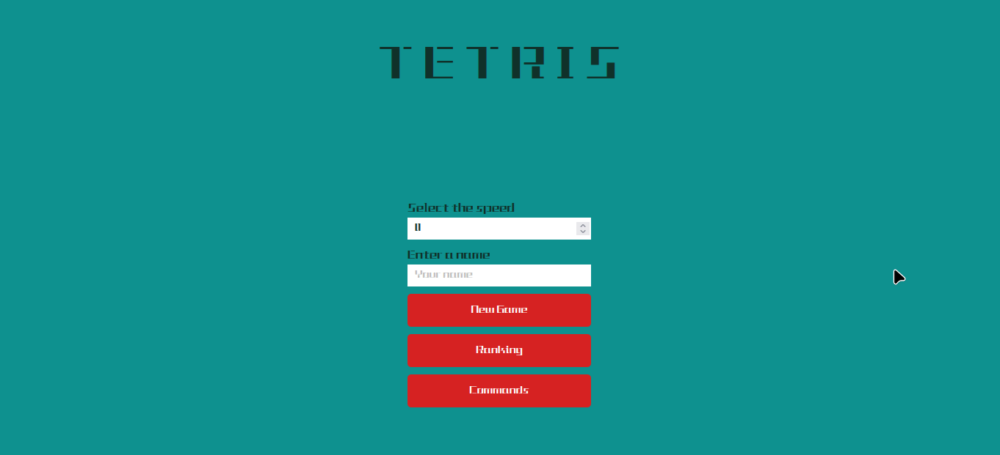
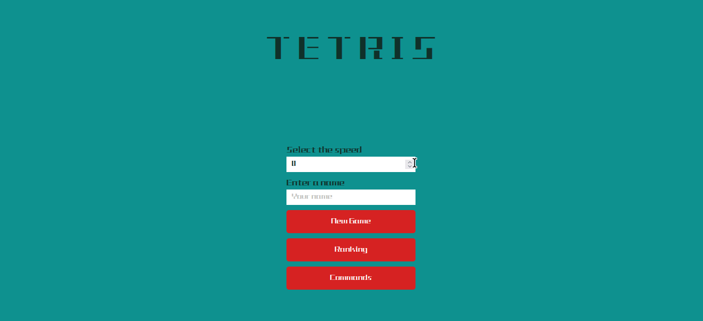
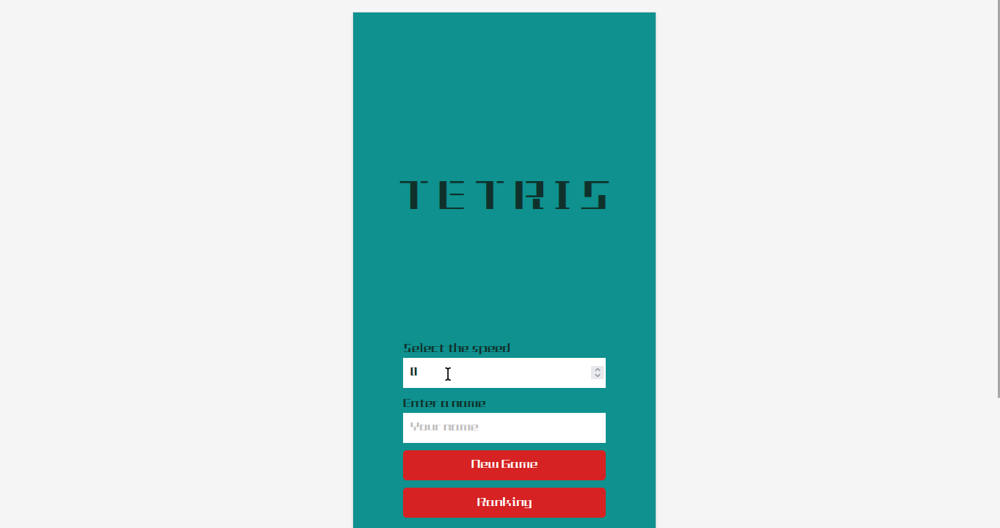

# Projeto pessoal: Tetris

## Sobre

Esse projeto Frontend é uma versão do mundialmente conhecido jogo Tetris, no estilo dos antigos jogos de mini-game dos anos 90.

Na tela inicial o usuário escolhe um nome, e a velocidade de descida das peças. Além disso, pode ir para a página com o ranking de melhores pontuações (usa-se armazenamento local).



## Comandos

Na versão desktop, temos os seguintes comandos:

- `↑ ou R`: rotaciona a peça (sentido horário)
- `↓ ou S`: move a peça para baixo (mais rapidamente)
- `→ ou D`: move a peça para a direita
- `← ou A`: move a peça para a esquerda



<br />

Na versão mobile, os comandos são feitos por meio de botões disponíveis na tela


<br />

O projeto pode ser visto em https://tetris-blond-omega.vercel.app/

## Tecnologias

Algumas das principais tecnologias e frameworks utilizados no projeto.<br/><br/>

<div>
    
    
    
    
    
    
    
</div>

## Como rodar o projeto

1. Clone o repositório

2. Instale as dependências

```bash
npm i
```

3. Execute o projeto

```bash
npm start
```

4. Acesse o endereço http://localhost:3000 no navegador de sua preferência.
